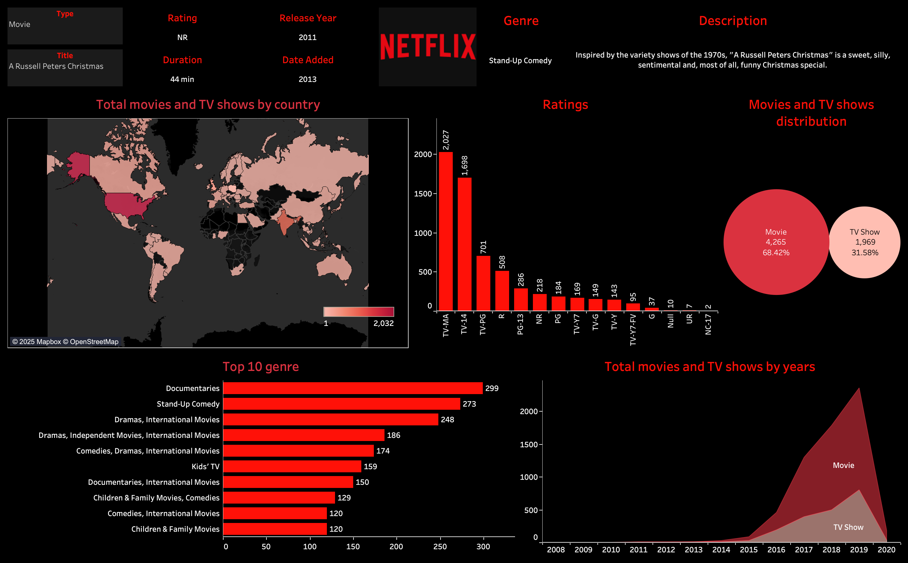

# Netflix Dashboard 🎥📊

This repository contains an interactive Tableau dashboard that visualizes data from the Netflix catalog. The dashboard provides insights into trends, genres, ratings, and other key metrics of Netflix's library.



---

## Features

- 🌍 **Global Insights**: Explore Netflix content distribution across countries.
- 📊 **Interactive Visualizations**: Analyze ratings, genres, release year trends, and more.
- 🔍 **Search Functionality**: Filter content by type, genre, country, etc.
- 📂 **Dataset**: Includes `netflix_titles.csv`, sourced from [Kaggle](https://www.kaggle.com/datasets/mahmoudtaya/netflix-titles).

---

## Dataset

The dataset contains the following columns:
- `show_id`: Unique ID for each title.
- `type`: Movie or TV Show.
- `title`: Title of the content.
- `director`: Director(s) of the content.
- `cast`: Cast members.
- `country`: Country of production.
- `date_added`: Date added to Netflix.
- `release_year`: Year of release.
- `rating`: Content rating (e.g., PG, TV-MA).
- `duration`: Duration of movies or number of seasons for TV shows.
- `listed_in`: Genres/categories.
- `description`: Short description.

---

## Installation

1. Clone the repository:
    ```
    git clone https://github.com/your-username/netflix-dashboard.git
    cd netflix-dashboard
    ```

2. Open the Tableau workbook (`dashboard.twbx`) in Tableau Desktop or Tableau Public.

3. Load the dataset (`data/netflix_titles.csv`) if required.

4. Explore the dashboard!

---

## Key Visualizations:
1. **Movies vs. TV Shows**: Pie chart showing distribution of movies and TV shows on Netflix.
2. **Top Genres**: Bar chart displaying popular genres.
3. **Content by Country**: Map showing the number of titles available in each country.
4. **Release Year Trends**: Line chart showing trends over time.

---

## Technologies Used

- **Tableau**: For creating interactive dashboards and visualizations.
- **CSV Dataset**: Data analysis and manipulation using Tableau's built-in tools.

---

## Acknowledgments

Special thanks to [Kaggle](https://www.kaggle.com/datasets/mahmoudtaya/netflix-titles) for providing the dataset used in this project.

---
